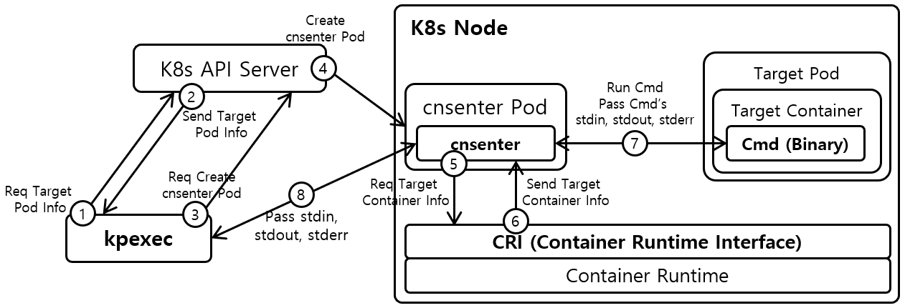

# kpexec


**kpexec** is a kubernetes cli that runs commands in a container with high privileges. It runs a highly privileged container on the same node as the target container and joins into the namespaces of the target container (IPC, UTS, PID, net, mount). This is useful for debugging where you often need to execute commands with high privileges. Also, kpexec has a tools mode, which adds useful debugging tools into the debugged container. The tools mode is useful when there necessary debugging tools are missing in the target container.

In contrast, kubectl-exec runs the command with the same privileges as the container. For example, if a container does not have network privileges, the command executed by kubectl-exec also has no network privileges. This makes debugging the pod difficult. If you use kpexec instead of kubectl-exec, you can easily get high privileges for debugging.

kpexec now supports the following container runtimes.
* containerd
* Docker

kpexec now supports the following CPU architectures.
* amd64
* arm64

## Install 

Since kpexec uses kubectl internally, **kubectl** installation and **kubeconfig** files must be properly configured before using kpexec. Whenever kpexec is executed, kpexec creates a cnsenter (Container Namespace Enter) pod to executes cnsenter. cnsenter is a command to exec command in the target container. The cnsenter pod must be created with **hostPID** and **Privileged** Option. Therefore, before using kpexec, you should check if the pod options mentioned are available in your kubernetes cluster. 

### Download Binary

Install via download the kpexec binary

```bash
$ export KPEXEC_VERSION=0.2.8

# Linux / amd64
$ wget -c "https://github.com/ssup2/kpexec/releases/download/v${KPEXEC_VERSION}/kpexec_${KPEXEC_VERSION}_Linux_amd64.tar.gz" -O - | tar -C /usr/local/bin/ -xz

# Linux / arm64
$ wget -c "https://github.com/ssup2/kpexec/releases/download/v${KPEXEC_VERSION}/kpexec_${KPEXEC_VERSION}_Linux_arm64.tar.gz" -O - | tar -C /usr/local/bin/ -xz

# macOS / amd64
$ wget -c "https://github.com/ssup2/kpexec/releases/download/v${KPEXEC_VERSION}/kpexec_${KPEXEC_VERSION}_Darwin_amd64.tar.gz" -O - | tar -C /usr/local/bin/ -xz

# macOS / arm64
$ wget -c "https://github.com/ssup2/kpexec/releases/download/v${KPEXEC_VERSION}/kpexec_${KPEXEC_VERSION}_Darwin_arm64.tar.gz" -O - | tar -C /usr/local/bin/ -xz

# Windows / amd64
# Download and install from https://github.com/ssup2/kpexec/releases/download/v${KPEXEC_VERSION}/kpexec_${KPEXEC_VERSION}_Windows_amd64.tar.gz
```

### Homebrew

Install via Homebrew.

```bash
$ brew install ssup2/tap/kpexec
```

### Krew

Install via Krew. kpexec is registered with krew under the name **pexec**. If you installed kpexec through Krew, you should use the **kubectl pexec** command instead of the kpexec command. And in this case, shell autocompetion doesn't work.

```bash
$ kubectl krew install pexec
```

## Set shell autocompletion (Optional)

kpexec supports shell autocompletion on Bash or Zsh shell. Before setting kpexec shell autocompletion, enable shell autocompletion via the link below.
* https://kubernetes.io/docs/tasks/tools/install-kubectl/#enabling-shell-autocompletion

### Bash

Set kpexec shell autocompletion to bash shell through the following commands.
```bash
$ source <(kpexec --completion bash) 
$ sudo sh -c "echo 'source <(kpexec --completion bash)' >>~/.bashrc"
```

### Zsh

Set kpexec shell autocompletion to zsh shell through the following commands.
```bash
$ source <(kpexec --completion zsh) 
$ sudo sh -c "echo 'source <(kpexec --completion zsh)' >>~/.zshrc"
```

## Usage 

Below are examples of kpexec usage.
```bash
# Get output from running 'date' command from pod mypod, using the first container by default.
$ kpexec mypod -- date

# Get output from running 'date' command in golang-container from pod mypod and namespace mynamespace.
$ kpexec -n mynamespace mypod -c date-container -- date

# Switch to raw terminal mode, sends stdin to 'bash' in bash-container from pod mypod 
# and sends stdout/stderr from 'bash' back to the client.
$ kpexec -it mypod -c bash-container -- bash

# Enable tools mode.
$ kpexec -it -T mypod -c golang-container -- bash

# Set cnsenter pod's image
$ kpexec -it -T --cnsenter-image=ssup2/my-cnsenter-tools:latest mypod -c golang-container -- bash

# kpexec removes the cnsetner pod it created after executing the command. 
# If cnsenter pods remain due to external factors, you can remove all remaining cnsenter pods 
# by executing cnsenter garbage collector.
$ kpexec --cnsenter-gc
```

## How it works



The figure above shows the operation processs of kpexec. At first, kpexec obtains the information of target pod from K8s API Server and finds out which Node the target pod exists in. After that, kpexec creates a cnsenter pod in the node where target pod exists and executes cnsetner. cnsenter gets the target container's pid and root directory information from containerd. Then cnsetner executes the command in the target container based on the obtained information.

cnsenter pod uses the below images defaultly. The cnsenter pod image can be set with the '--cnsetner-image' option.
* default mode - ssup2/cnsenter:[kpexec version]
* tools mode - ssup2/cnsenter-tools:[kpexec version]
